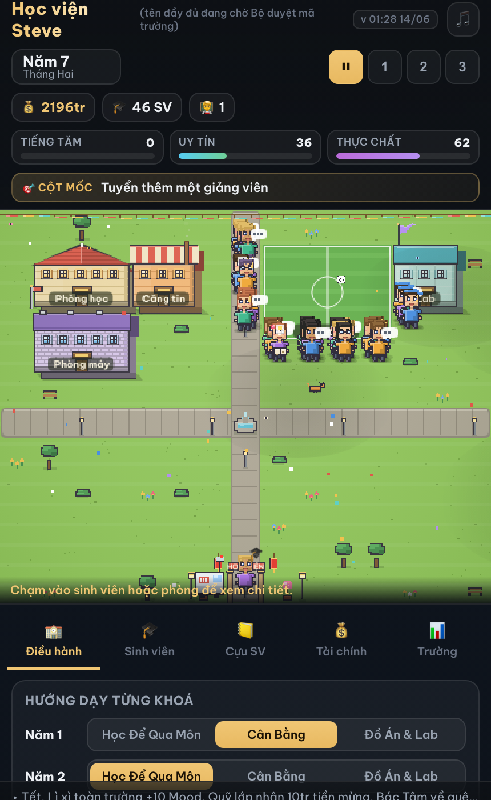

# Học viện Steve

*A sunny, slightly chaotic little Vietnamese university you build from an empty lot — and secretly, a
**playable essay** on the real 2026 THPT đề Văn:*

> ### "Làm thế nào để Việt Nam có những *Steve Jobs Việt Nam*?"

You don't get told the answer. You found a school, set its philosophy, and **watch the little people grow
up and scatter into the world** — engineers, founders, văn-mẫu clerks, coin sharks, the graduate who
never comes back… and the rare 🍎. You arrive at **your own** answer.

### ▶ Play: **https://techeese.github.io/steve-job-vietnam/** &nbsp;·&nbsp; best on a phone

<p align="center"></p>

## What it is

A satirical **university-management sim** in the Kairosoft register (build rooms, set policy, watch it
tick) — **not a clicker**. Vietnamese-first, dry rather than cruel, entirely fictional. The whole game
argues that you can't *manufacture* a Steve Jobs by drilling for exams — but you can't be sure what does
work either, so it hands you the question instead of a verdict.

- **Biographies, not scores.** Every graduate gets a life that spans years and *switches states* — the
  ★★★★★ talent who becomes a coin shark and gets arrested; the quiet one who becomes a kỹ sư and sends
  money home. The 🍎 (a real creator) is rare and earned; the văn-mẫu clerk and coin shark are the traps.
- **The LATTICE.** Eras (decades that re-weight the sim) × demographic/geographic archetypes × a deepened
  person-sim × legacy (cross-run seeding). Khoa with synergies and a multi-year **Cúp Khoa** trophy race.
- **Choices with moral tension.** Topical fictional events (văn mẫu, học thêm, AI làm hộ, brain drain) —
  each a real fork. A **closing essay** assembled from *your* graduates answers the đề Văn — never a lecture.

## How it's built

A dependency-light **static web game** — no framework, no build step, just `index.html` + a few JS
modules, deployed on GitHub Pages. Strictly one-directional architecture, tended as a living thing:

```
data.js     numbers (CONFIG) + text (CONTENT) — no logic
engine.js   state + simulation — DOM-free, node-testable (the destiny FSM lives here)
art.js      pure pixel-art drawers (rooms, props, tiles)
sprites.js  the character bakery (24×32 chibi atlas + customizer)
audio.js    generative campus-lofi + musical SFX (no asset files)
ui.js       canvas render + HUD + panels + modals (orchestration)
```

`ui → {art, sprites, audio} → engine → data`. The engine is pure enough to play headlessly.

To run locally, serve the folder over any static server and open `index.html` (e.g.
`python3 -m http.server`). Deploy = push to the GitHub Pages branch; there is no build step.

## Verification (headless harnesses)

Graphics are frozen in the gameplay-first phase, so every change is gated headless:

```bash
./gate.sh        # engine gates: fresh boot, admissions, alumni-replay determinism, save migration, builds
node sweep.js    # 40 seeds × strategies × ~11y — checks the destiny thesis (no dominant strategy) + soul flags
./bot.sh         # full-game in-browser smoke test: plays ~11 years, renders every tab, asserts no JSERR
./lives.sh       # headless biography emitter — prints a preset's epilogue essay (named lives + waste lines)
./lab.sh         # the GAMEPLAY LAB: a graphics-free browser window to WATCH the sim in words and compare presets
```

## Tone

Satire anchored in real cultural moments, dry and affectionate, all characters fictional. Honoured real
educators (the Pantheon) are reverent-only. The game holds the question open — it reflects consequences,
it never lectures.

---

*Built iteratively, in the open. See [`CHANGELOG.md`](CHANGELOG.md) for how it grew, and
[`VISION.md`](VISION.md) / [`DESIGN.md`](DESIGN.md) / [`THESIS.md`](THESIS.md) for the north star and the
settled law.*
